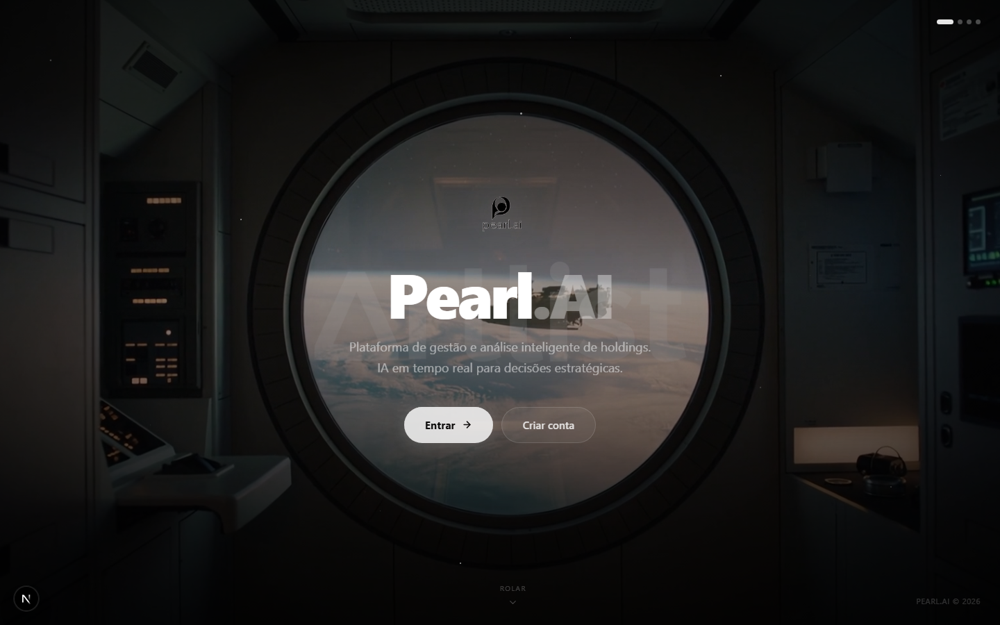
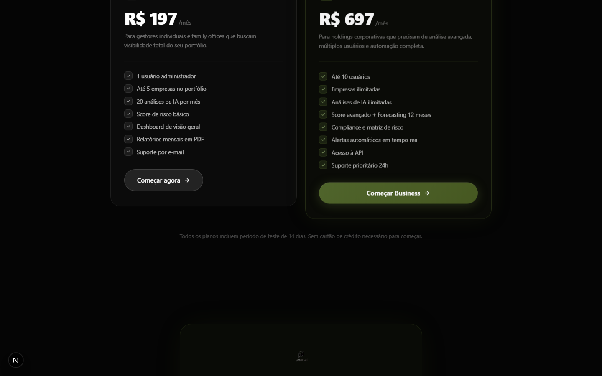
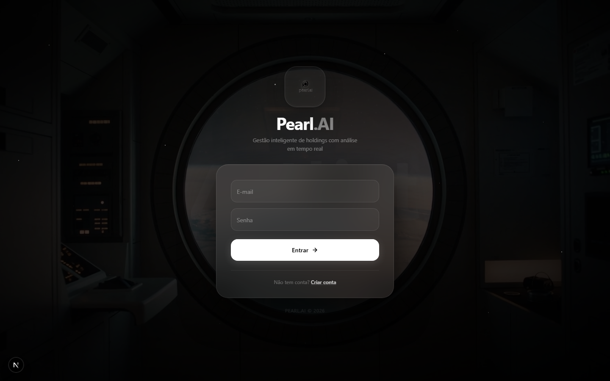
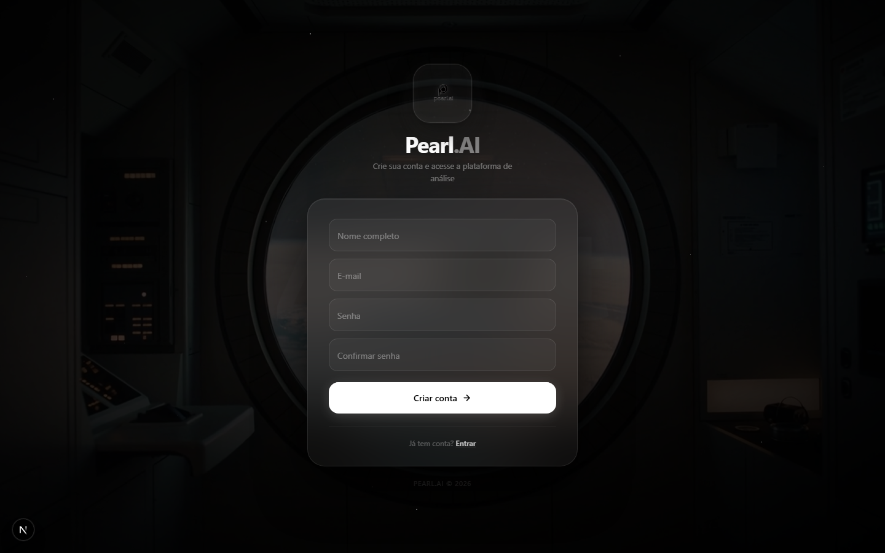
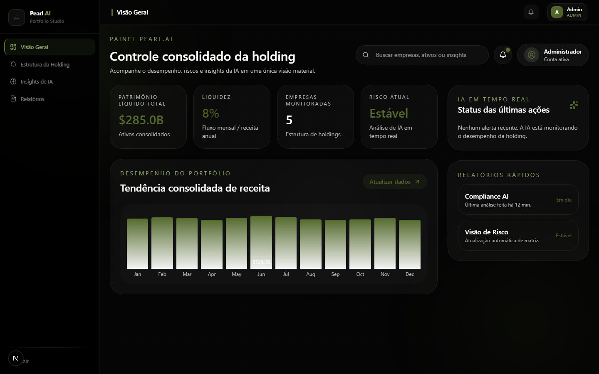

# Pearl.AI — Plataforma de Gestão Inteligente de Holdings

> Análise de portfólio com IA em tempo real para gestores de holdings e family offices.

Pearl.AI é uma plataforma web completa para gestão, monitoramento e análise estratégica de holdings. Construída com Next.js 16, integra Claude Sonnet para análises automáticas de empresas, forecasting de receita com método de Holt, sistema de scoring proprietário e um assistente de inteligência estratégica conversacional.

---

## Interface

### Home — Hero



### Home — Features & Planos




### Login



### Cadastro



### Dashboard — Visão Geral



---

## Funcionalidades

- **IA em Tempo Real** — Análise profunda de empresas com Claude Sonnet: resumo executivo, pontos fortes, riscos, perspectiva e recomendação estratégica
- **Score de Empresas** — Sistema proprietário de pontuação: saúde de receita, crescimento, cobertura de ativos, eficiência e nível de risco
- **Forecasting de Receita** — Previsão para os próximos 12 meses com método de Holt e intervalo de confiança
- **Gestão de Portfólio** — Visão consolidada de todas as empresas, ativos e receitas da holding
- **Intel Estratégica** — Assistente conversacional que extrai keywords e gera briefings executivos da holding
- **Setup Wizard** — Onboarding guiado para configurar o perfil e as primeiras empresas

---

## Stack

| Camada | Tecnologia |
|--------|-----------|
| Framework | Next.js 16 (App Router, Turbopack) |
| Linguagem | TypeScript 5 |
| Estilo | Tailwind CSS v4 |
| Banco de Dados | SQLite via Prisma ORM |
| Autenticação | NextAuth v5 (JWT + Credentials) |
| IA | Anthropic Claude Sonnet (`@anthropic-ai/sdk`) |
| Segurança | bcryptjs para hash de senhas |

---

## Instalação

```bash
# Clone o repositório
git clone git@github.com:leosan123456/Pearl.git
cd Pearl/Peral.ai/holding-marketplace

# Instale as dependências
npm install

# Configure as variáveis de ambiente
cp .env.example .env
# Edite .env e preencha ANTHROPIC_API_KEY

# Rode as migrations do banco
npx prisma migrate deploy

# (Opcional) Popule com dados de exemplo
curl -X POST http://localhost:3000/api/seed

# Inicie o servidor de desenvolvimento
npm run dev
```

Acesse [http://localhost:3000](http://localhost:3000).

---

## Variáveis de Ambiente

```env
DATABASE_URL="file:./prisma/dev.db"
NEXTAUTH_SECRET="sua-chave-secreta"
NEXTAUTH_URL="http://localhost:3000"
ANTHROPIC_API_KEY="sua-api-key-anthropic"
```

---

## Estrutura do Projeto

```
holding-marketplace/
├── app/
│   ├── api/              # API Routes (auth, companies, AI, intel, profile, seed, upload)
│   ├── dashboard/        # Páginas do dashboard (overview, companies, AI, intel, setup, admin)
│   ├── login/            # Página de login
│   ├── register/         # Página de cadastro
│   └── page.tsx          # Landing page
├── components/           # Componentes reutilizáveis
├── lib/                  # Lógica de negócio (claude, scoring, forecasting, prisma, utils)
├── prisma/               # Schema e migrations do banco
├── public/               # Assets estáticos (logo, vídeos)
└── types/                # Types TypeScript globais
```

---

## Rotas da API

| Método | Rota | Descrição |
|--------|------|-----------|
| `POST` | `/api/auth/register` | Registro de novo usuário |
| `GET/POST` | `/api/companies` | Listar / criar empresas |
| `GET/PUT/DELETE` | `/api/companies/[id]` | Operações por empresa |
| `POST` | `/api/ai/analyze/[id]` | Gerar análise de IA |
| `POST` | `/api/ai/score/[id]` | Calcular e salvar score |
| `POST` | `/api/ai/forecast/[id]` | Gerar previsão de receita |
| `GET/POST` | `/api/intel/chat` | Chat do assistente Intel |
| `GET/POST` | `/api/intel/sessions` | Sessões de Intel |
| `GET/PUT` | `/api/profile` | Perfil do usuário |
| `POST` | `/api/profile/complete` | Completar perfil |
| `POST` | `/api/upload/company-logo` | Upload de logo |
| `POST` | `/api/seed` | Popular banco com dados de exemplo |

---

## Licença

Proprietário — Pearl.AI © 2026
